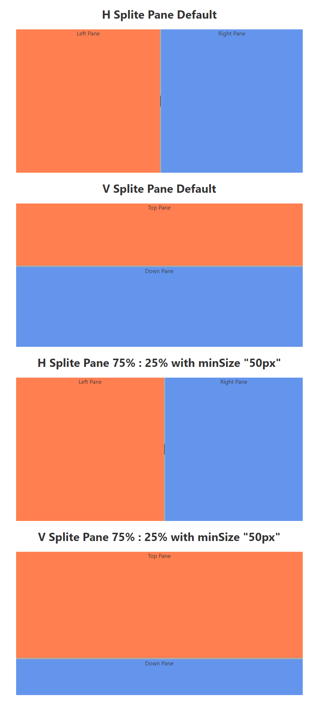

# Split Pane for Svelte

This is a splitter plugin for Svelte Application.

Easy to use to separate panes horizontally / vertically.



## Example

- GitHub Pages Example: http://www.readiz.com/svelte-split-pane/
- Svelte REPL Example: https://svelte.dev/repl/5ab84358dd8b46ad9474884f2359ff9b?version=3

## Usage

Just use slots to place contents.
```html
<script>
    import { HSplitPane, VSplitPane } from 'svelte-split-pane';
</script>
<h1>H Splite Pane Default</h1>
<div class="wrapper">
<HSplitPane updateCallback={() => {
    console.log('HSplitPane Updated!');
}}>
    <left slot="left">
        Left Pane
    </left>
    <right slot="right">
        Right Pane
    </right>
</HSplitPane>
</div>
<h1>V Splite Pane Default</h1>
<div class="wrapper">
<VSplitPane updateCallback={() => {
    console.log('VSplitPane Updated!');
}}>
    <top slot="top">
        Top Pane
    </top>
    <down slot="down">
        Down Pane
    </down>
</VSplitPane>
</div>
```

## Optional Parameters

- updateCallback: this is called when splitting is finished.
- [left|right|top|down]PaneSize: Specify the Pane size. (Default: 50%)
- min[left|right|top|down]PaneSize: Specify minimum value of the each Pane.

## License

- MIT
- PR & Suggestions are welcome!
